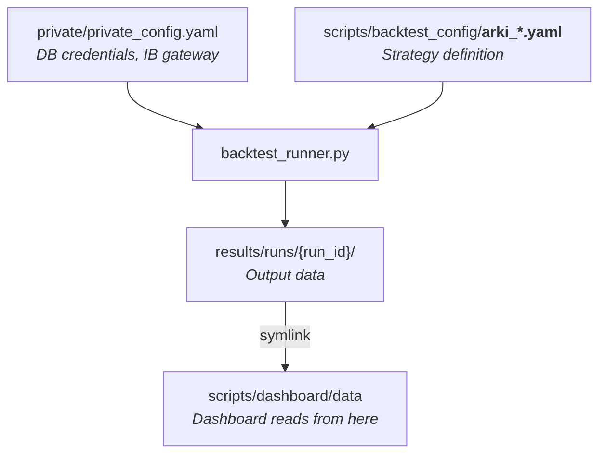

# pysystemtrade Config Knowledge Map

> [!TIP]
> Bookmark this file. It answers: "Which config file does what?"

---

## 1. Config Hierarchy (What Controls What)



| File | Role | Edit Frequency |
|------|------|----------------|
| `private/private_config.yaml` | DB/IB connection credentials | Rarely |
| `scripts/backtest_config/arki_*.yaml` | **Strategy definition** (instruments, rules, weights) | Per experiment |
| `results/runs/registry.yaml` | Auto-generated run log | Never (auto) |
| `docs/arki/README.md` | Naming conventions & directory ownership | Rarely |

---

## 2. Backtest Config Files — Which One Matters?

### ⭐ The One You Need to Know

| File | Status | Description |
|------|--------|-------------|
| **`arki_production.yaml`** | **CURRENT PRODUCTION** | 25 instruments, all estimations enabled, risk overlay, the "v4" that dashboard currently shows |

### Experiment Configs (v5 series)

| File | What Changed | Key Result |
|------|-------------|------------|
| `arki_v5_dynamic.yaml` | Dynamic instrument weights + 35/20/45 factor tilt | 2020-26 SR: 0.75 (★ best) |
| `arki_v5b_factor_tilt.yaml` | Equal weights + 30/15/55 CS Momentum tilt | Last 1Y SR: 0.77 (★ best) |
| `arki_v5c_combined.yaml` | Both levers combined | Underperformed |

> [!IMPORTANT]
> **None of the v5 configs are promoted to production yet.** The dashboard still points to a v4 run.

### Legacy / Reference (can ignore)

| File | Purpose |
|------|---------|
| `trend_carry_csmom.yaml` | Original fixed-weight config (no estimation). Baseline "v4 simple" |
| `trend_carry_csmom_estimated.yaml` | Early estimated variant, predates arki_ naming |
| `arki_v3_25inst.yaml` | Historical — 25-instrument expansion experiment |
| `arki_v4_optimized.yaml` | Historical — intermediate optimization |
| `trend_only.yaml` | Single-factor test (trend only) |
| `carry_only.yaml` | Single-factor test (carry only) |
| `custom_template.yaml` | Blank template for new configs |

---

## 3. What's Inside a Config YAML?

Every `arki_*.yaml` is **self-contained**. It has everything the runner needs:

```yaml
# 1. INSTRUMENTS — What to trade (25 futures)
instruments:
  - SP500_micro
  - GOLD_micro
  - ...

# 2. TRADING RULES — How to generate signals (11 rules)
trading_rules:
  momentum4: ...    # EWMAC(4,16)
  carry30: ...      # Carry(30d smooth)
  relmomentum20: ...# Relative momentum(20d)

# 3. FORECAST WEIGHTS — How much weight per signal
forecast_weights:
  momentum4: 0.067  # 1/3 Trend ÷ 5 rules
  carry30: 0.111    # 1/3 Carry ÷ 3 rules
  relmomentum20: 0.111

# 4. POSITION SIZING — Risk budget
percentage_vol_target: 25.0
notional_trading_capital: 200000

# 5. ESTIMATION FLAGS (optional) — Let system estimate vs fixed
use_instrument_weight_estimates: True  # Dynamic instrument allocation
use_forecast_weight_estimates: True    # Data-driven factor weights
```

### Key Difference: `arki_production.yaml` vs `trend_carry_csmom.yaml`

| Feature | `trend_carry_csmom.yaml` | `arki_production.yaml` |
|---------|--------------------------|------------------------|
| Instrument weights | Equal 4% (fixed) | **Estimated** (data-driven) |
| Forecast weights | Fixed 1/3 each factor | **Estimated** |
| Forecast scalars | Fixed (Carver book values) | **Estimated** |
| Risk overlay | None | **Enabled** |
| Vol calculation | Default | **Custom** (slow=35%) |

---

## 4. Run Management

### How a Backtest Flows

```
1. Choose config:  arki_production.yaml
2. Run:            python scripts/backtest_runner.py run --label "name" ...
3. Output:         results/runs/20260405_0900_name/
4. Dashboard:      ln -sf ../../results/runs/{run_id} scripts/dashboard/data
5. View:           http://localhost:8787
```

### Current Dashboard Data Source

```
scripts/dashboard/data → ../../results/runs/20260405_0900_arki_v4_fresh_data
```

### All Runs (chronological)

| Run | Config | Instruments | Net SR |
|-----|--------|-------------|--------|
| baseline_phase3 | estimated | 46 | 1.24 |
| arki_v1_16inst | production | 16 | 0.59 |
| arki_v2_micro | - | - | - |
| arki_v3_25inst | v3 | 25 | - |
| arki_v4_optimized | v4 | 25 | - |
| **arki_v4_fresh_data** | **production** | **25** | **—** ← Dashboard |
| arki_v5_dynamic_25 | v5a | 25 | 0.84 |
| arki_v5b_factor_tilt | v5b | 25 | 0.81 |
| arki_v5c_combined | v5c | 25 | 0.68 |

---

## 5. Quick Reference Commands

```bash
# Run backtest (config is self-contained, no --instruments-from needed)
python scripts/backtest_runner.py run --label "name" --capital 200000 --mode dynamic \
  --config scripts/backtest_config/arki_production.yaml

# List all runs
python scripts/backtest_runner.py list

# Switch dashboard to a different run
rm -f scripts/dashboard/data
ln -sf ../../results/runs/{RUN_ID} scripts/dashboard/data

# Start dashboard
cd scripts/dashboard && python3 -m http.server 8787
```

---

## 6. Files You Can Safely Ignore

| File/Dir | Why |
|----------|-----|
| `results/optimal_instruments_200k.yaml` | Legacy. Runner no longer uses it as default |
| `sysdata/`, `sysinit/`, `systems/` | pysystemtrade core — don't edit |
| `data/parquet_store/` | Raw price data — managed via IB pipeline |
