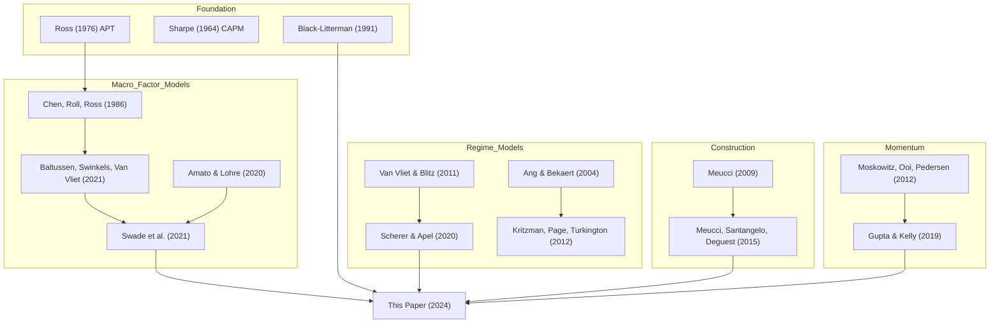

# A Century of Macro Factor Investing — Complete Analysis

**Paper**: Swade, Lohre, Nolte, Shackleton & Swinkels (2024)
**Affiliation**: Lancaster University / Robeco / Erasmus University Rotterdam
**Published**: Journal of Portfolio Management (forthcoming, Jan 2024)
**SSRN**: [https://ssrn.com/abstract=4699060](https://ssrn.com/abstract=4699060)

---

## 1. Core Thesis

The paper constructs a **multi-asset multi-factor** portfolio diversified across three **macroeconomic factors** — Growth, Inflation, Defensive — that are mimicked by investable asset classes and style factors. Using **100 years of global data** (1918–2021), it demonstrates:

1. Macro factor-mimicking portfolios (MFMPs) are more robust than raw macro factor proxies
2. A risk-parity combination (MFRP) delivers strong risk-adjusted returns across regimes
3. A **dynamic tactical overlay** using business cycle signals + time-series momentum dramatically improves performance
4. The Black-Litterman framework provides a natural vehicle for combining strategic and tactical views

> [!IMPORTANT]
> The primary contribution is a **framework**, not a directly replicable trading strategy. The empirical results illustrate the potential of the approach.

---

## 2. Investment Universe

### 2.1 Asset Classes (3 indices)
| Asset Class | Ret p.a. | Vol p.a. | SR | MaxDD |
|---|---|---|---|---|
| Global Equities | 9.41% | 15.07% | 0.62 | -70.20% |
| Global Bonds | 5.06% | 3.94% | 1.28 | -10.71% |
| Commodities | 2.69% | 18.57% | 0.14 | -93.05% |

### 2.2 Style Factors (16 long-short factors)
Four style factors — **BAB, Carry, Momentum, Value** — within each of four domains: Equities, Rates, Commodities, FX.

| Factor | Best SR | Worst SR |
|---|---|---|
| **Equity** | Momentum (0.69) | Value (0.21) |
| **Rates** | Carry (0.57) | BAB (0.09) |
| **Commodities** | Momentum (0.54) | BAB (0.13) |
| **FX** | Carry (0.29) | Value (0.03) |

- 15 out of 20 strategies have statistically significant Sharpe ratios
- Data: Baltussen, Swinkels, Van Vliet (2021) dataset — Bloomberg, Datastream, OECD, Global Financial Data
- All returns: excess of local risk-free rates, USD-denominated

### 2.3 Total Universe: 3 asset class indices + 16 style factors + 1 FX BAB = **20 instruments**

---

## 3. Three Macro Factors

The authors choose a **parsimonious set of 3 macro factors** motivated by economic intuition and statistical clustering:

| Macro Factor | Economic Rationale | Proxy |
|---|---|---|
| **Growth** | Drives future cash flows | Global Equities Index |
| **Inflation** | Impacts present value of cash flows | Commodities Index |
| **Defensive** | Performs well when Growth/Inflation fail | Global Treasuries Index |

> [!NOTE]
> The choice of proxies is **not fixed** — investors can substitute alternative proxies without loss of generality. The key insight is that the MFMP construction **diversifies within** each macro factor using all 20 investable instruments.

---

## 4. MFMP Construction Methodology

### 4.1 Minimum Torsion Orthogonalization (Meucci et al., 2015)

The core technical innovation: transform correlated macro factors into **uncorrelated orthogonal factors** while minimizing tracking error to originals.

**Step-by-step:**
1. Start with K-factor model: `R = B·F + ε` (APT framework)
2. Compute minimum torsion matrix `t_orth` that makes factors uncorrelated: `F_orth = t_orth · F`
3. Derive MFMP weights: `w_MFMP = t_orth · B^(-1)` (Moore-Penrose inverse)
4. MFMP returns: `R_MFMP = t_orth · B^(-1) · R`

**Key equation (Minimum Torsion):**
```
t_orth = argmin_{t: Cor(tF) = I_K} sqrt(1/K · Σ_k Var((tF)_k - F_k) / σ_F_k)
```

### 4.2 Portfolio Construction

- **Expanding window** estimation, initial = 48 months → OOS from Jan 1922
- Constrained **mean-variance optimization** targeting unconstrained MFMP with **quadratic transaction cost penalty**:
  ```
  max_w  w'μ - (γ/2)w'Σw - λ_TC · Γ'|Δw|²
  ```
  - Risk aversion γ = 5
  - TC scaling λ_TC = 0.3
  - TC vector Γ = linear in diagonal of variance-covariance matrix

### 4.3 Risk Parity (MFRP)

Equal risk contribution across the 3 orthogonal MFMPs:
```
ρ_k = w²_orth_k · σ²_orth_k / Var(R_w)
```
Diversification measured by **Effective Number of Uncorrelated Bets**:
```
N_Ent = exp(-ρ' · ln(ρ))    range: [1, K]
```

---

## 5. 100-Year Empirical Results

### 5.1 MFMP Performance (Full Sample: Jan 1922 – Dec 2021)

| Portfolio | Ret p.a. | Vol p.a. | SR | MaxDD |
|---|---|---|---|---|
| Growth MFMP | 19.88% | 17.07% | 0.98 | -58.25% |
| Defensive MFMP | 13.38% | 6.51% | **1.56** | -11.60% |
| Inflation MFMP | 10.34% | 19.47% | 0.37 | -85.35% |
| **MFRP (Risk Parity)** | **16.07%** | **9.22%** | **1.39** | **-27.18%** |

> [!TIP]
> The **Defensive MFMP** has the best SR (1.56) and smallest MaxDD (-11.60%). The MFRP combines the three with dramatically reduced drawdowns vs. individual MFMPs.

### 5.2 Performance Across Economic Regimes

#### Bull vs. Bear Markets (78 bull years / 22 bear years)

| Portfolio | Bull SR | Bear SR |
|---|---|---|
| Growth MFMP | 1.58 | -0.62 |
| Defensive MFMP | 1.61 | 1.39 |
| Inflation MFMP | 0.53 | -0.17 |
| **MFRP** | **1.74** | **0.29** |

#### NBER Expansion vs. Recession (85 expansion / 15 recession years)

| Portfolio | Expansion SR | Recession SR |
|---|---|---|
| Growth MFMP | 1.26 | -0.34 |
| Defensive MFMP | 1.51 | **1.87** |
| **MFRP** | **1.56** | **0.59** |

#### Growth/Inflation Quadrant

| Regime | Years | Best MFMP | MFRP SR |
|---|---|---|---|
| +Growth / +Inflation | 72 | Growth (1.66) | **1.77** |
| +Growth / -Inflation | 6 | Defensive (1.65) | 1.41 |
| -Growth / +Inflation | 20 | Defensive (1.49) | 0.52 |
| -Growth / -Inflation | 2 | Defensive (0.38) | -1.80 |

> [!WARNING]
> The MFRP **underperforms Defensive MFMP** in bear markets (SR 0.29 vs 1.39) and recessions (0.59 vs 1.87). This gap motivates the dynamic tactical overlay.

---

## 6. Business Cycle Timing Model

### 6.1 Indicator Construction

Five US-based macroeconomic indicators aggregated into a single Z-score:

| Category | Indicator | Signal Logic |
|---|---|---|
| Market-based | S&P 500 P/E ratio | High → expansion |
| Market-based | AAA–BAA credit spread | Small → expansion |
| Output | Log change in production (1m lead) | Positive → expansion |
| Consumption | Expected inflation (fitted AR) | — |
| Consumption | Unexpected inflation (residual) | — |

**Processing:**
1. Standardize each indicator (Z-score)
2. Winsorize at ±3σ (expanding window)
3. Equal-weight combine into aggregate Z-score

### 6.2 Four Business Cycle Regimes

Defined by the **sign** (level) and **direction** (annual change) of the aggregate Z-score:

| Regime | Z-Score Level | Z-Score Trend | Months | Avg Duration |
|---|---|---|---|---|
| **Expansion** | Positive (+) | Increasing (↑) | 567 | 9.78 mo |
| **Peak** | Positive (+) | Decreasing (↓) | 395 | 7.45 mo |
| **Recession** | Negative (-) | Decreasing (↓) | 160 | 6.40 mo |
| **Recovery** | Negative (-) | Increasing (↑) | 48 | 3.69 mo |

**Regime switch filter**: demand 2 consecutive uniform changes OR a 1σ deviation in a single month.

### 6.3 Transition Matrix

```
             → Expansion   Peak   Recession   Recovery
Expansion      89.93%     7.95%    1.41%      0.71%
Peak           10.13%    86.58%    3.29%      0.00%
Recession       6.25%     4.38%   84.38%      5.00%
Recovery       16.67%     2.08%    8.33%     72.92%
```

- Highly persistent: 73–90% probability of staying in same regime
- NBER recession overlap: 53% in Recession regime, 21% in Peak regime
- Recovery is the rarest and shortest regime (48 months, 3.69 avg)

---

## 7. Dynamic Allocation via Black-Litterman

### 7.1 BL Framework

**Master formula:**
```
μ_BL = [(τΣ)^(-1) + P'Ω^(-1)P]^(-1) · [(τΣ)^(-1)Π + P'Ω^(-1)Q]
```

| Parameter | Value |
|---|---|
| τ (scaling) | 0.015 |
| Ω (view uncertainty) | diag(Σ) |
| Π (equilibrium returns) | γ · Σ · w_MFRP |
| Benchmark | MFRP portfolio |

### 7.2 Macro Factor View Portfolios (by Regime)

| Regime | Growth | Defensive | Inflation |
|---|---|---|---|
| **Expansion** | 100% | 0% | 0% |
| **Peak** | 80% | 20% | 0% |
| **Recession** | 80% | 120% | **-100%** |
| **Recovery** | **200%** | 0% | **-100%** |

> [!NOTE]
> View portfolios are **not optimized** — they are simple, intuitive allocations. The paper emphasizes that efficacy depends on **regime forecast accuracy**, not view portfolio precision.

### 7.3 Time-Series Momentum (TSM) Views

Based on Gupta & Kelly (2019):
```
f_TSM_{i,t} = s_{i,t-1} × f_{i,t}

s_{i,t-1} = clip(Σ_τ f_{i,t-τ-1} / σ_{i,t-1}, -2, 2)
```
- Formation window j=1, exclusion window k=0 (short-term)
- Volatility σ estimated over previous 36 months
- Z-scores capped at ±2
- Long leg: positive signals; Short leg: negative signals → unit leverage

---

## 8. Combined Strategy Performance (OOS: Jan 1924 – May 2021)

### 8.1 Summary Table

| Strategy | Return | Vol | **SR** | **IR** | Hit Ratio | Turnover |
|---|---|---|---|---|---|---|
| MFRP (anchor) | 16.04% | 9.17% | 1.75 | — | — | 2.77% |
| MFRP + Macro | 16.76% | 9.18% | 1.83 | 0.49 | 48.50% | 22.14% |
| MFRP + Momentum | 22.10% | 9.27% | 2.39 | 1.55 | 64.59% | 71.60% |
| **MFRP + Macro + Mom** | **23.29%** | **9.30%** | **2.50** | **1.73** | **71.17%** | **79.64%** |

### 8.2 Regime-Specific Performance (Combined Macro + Momentum)

| Metric | Expansion | Peak | Recession | Recovery |
|---|---|---|---|---|
| Return p.a. | 23.03% | 21.94% | 25.20% | **31.34%** |
| Volatility | 9.20% | 8.01% | 11.25% | 12.58% |
| **Sharpe Ratio** | 2.50 | **2.74** | 2.24 | 2.49 |
| **Information Ratio** | 1.64 | 1.72 | 1.91 | **2.89** |
| Hit Ratio | 68.96% | 71.39% | 75.62% | **80.85%** |
| Turnover | 76.92% | 75.91% | 93.32% | 97.09% |

> [!TIP]
> **Key insight**: The combined strategy's greatest outperformance (IR 2.89) occurs during **Recovery** periods — exactly when most investors are still defensive. The macro signal provides the conviction to pivot aggressively (200% Growth, -100% Inflation) at regime transitions.

---

## 9. Key Takeaways for Arki Macro Framework

### 9.1 Directly Applicable Concepts

1. **3-Factor Macro Decomposition**: Growth / Inflation / Defensive maps cleanly to Arki's multi-asset thinking
2. **Minimum Torsion Orthogonalization**: Superior to naive PCA for keeping economic interpretability
3. **Risk Parity across Macro Factors** (not asset classes): More economically meaningful than standard risk parity
4. **Business Cycle Model**: 5 simple indicators → aggregate Z-score → 4 regimes — implementable today
5. **Black-Litterman as the Tactical Vehicle**: Natural way to combine strategic (MFRP) and tactical (macro/momentum) views
6. **TSM as Complementary Signal**: Momentum + macro are highly complementary (IR 1.73 combined vs 0.49 macro-only)

### 9.2 Implementation Considerations

| Aspect | Paper Approach | Practical Note |
|---|---|---|
| **Data** | 100yr monthly | Sufficient for regime analysis, but earlier data quality varies |
| **Rebalancing** | Monthly | Turnover of 80% p.a. with combined strategy — implementable via futures |
| **Transaction costs** | 10 bps two-way | Conservative for liquid futures; may underestimate for some commodity/FX factors |
| **Regime detection** | In-sample proxies → OOS | Requires 2 consecutive signals or 1σ move — reduces whipsaw |
| **View portfolios** | Heuristic, not optimized | Deliberate choice — makes framework robust to specification error |
| **Leverage** | Allowed in views | Recovery regime = 200% Growth, -100% Inflation → net leverage |

### 9.3 Critical Observations

> [!CAUTION]
> 1. **Macro-only signal has sub-50% hit ratio** (48.50%) — outperformance is driven by magnitude, not frequency. This requires **conviction and discipline** to hold through losing months.
> 2. **Recovery regime is extremely rare** (48 months / 3.69 avg duration) yet delivers the highest IR (2.89). The strategy's edge is concentrated in regime transitions.
> 3. **Inflation MFMP** is the weakest component (SR 0.37, MaxDD -85.35%). Its value is primarily as a **shorting candidate** during recession/recovery.

---

## 10. Literature Map



---

*Analysis completed: 2026-04-18*
